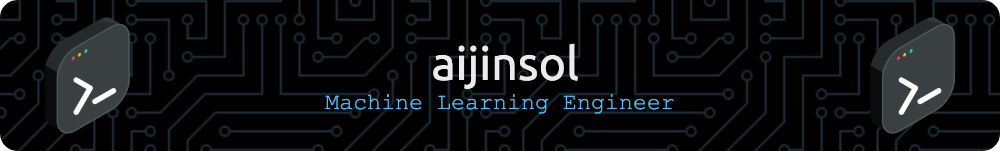

    

    
    
    
    
    
    

 

    

## 💪🏻 Tech Stack

| Category             | Skills               |
|:---------------------|:---------------------|
| Language             |    |
| Backend Engineering  |    |
| ML Engineering       |   |
| Data Engineering     |   |
| Cloud Platform       |  |

